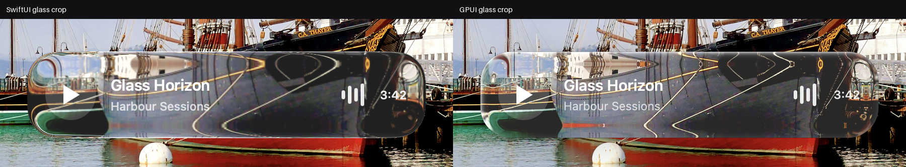

# Liquid Glass for GPUI

**Apple's Liquid Glass as a live GPU material for [GPUI](https://gpui.rs)** —
a real scene primitive that refracts whatever your app drew this frame, plus a
one-line way to make the whole window native glass on macOS 26 and later.

[](https://github.com/1234igor/gpui-liquid-glass/actions/workflows/ci.yml)
[](https://www.rust-lang.org)
[](https://gpui.rs)
[](#requirements)
[](LICENSE)


Not a blur behind a rounded rectangle. The macOS renderer snapshots the current
drawable **on the GPU**, runs a separable Gaussian blur, then applies
refraction, rims, tint, interaction energy and shadow — with no readback to the
CPU at any point. Snapshot and blur textures persist across frames, and
identical overlapping effects in one paint layer are coalesced, which is the job
SwiftUI's `GlassEffectContainer` does for grouped controls.

Because it samples whatever was already painted, it is meant for video, games,
scrolling content and anything else that moves. Content drawn afterwards stays
sharp.

## How close is it?

Side by side against a real SwiftUI `.glassEffect` built with Xcode:



Every material, over four deliberately hostile backgrounds, compared pixel by
pixel. Measured on macOS 27, 16 pairs at 2400 × 1600:

| Metric | Range across the matrix |
|--------|------------------------|
| Glass-crop similarity | 94.42 – 97.17 % |
| Whole-window similarity | 99.50 – 99.74 % |

Two of the sixteen miss a gate — `city-night / regular` at 94.42 % against a
95 % floor, and `harbour / clear` at 4.03 % severe local error against a 3.75 %
ceiling. The material was calibrated against macOS 26 and macOS 27 moved it
slightly; the gates have been left where they are rather than loosened to make
the run green.

The reference app, the capture scripts and the comparison tool are in
[`validation/`](validation/README.md), so every number here is reproducible
rather than claimed.

## Try it

```sh
git clone https://github.com/1234igor/gpui-liquid-glass
cd gpui-liquid-glass/gpui
cargo run --release
```

The default executable is the integration example: dynamic content underneath,
glass in the middle, crisp controls above it. Drive it from the command line:

```sh
cargo run --release -- clear-tinted hover facade
cargo run --release -- regular rest harbour dynamic
```

Materials are Regular, Clear, Regular Tinted, Clear Tinted and Identity.
Identity omits the optics and elevation while keeping the surrounding component
hierarchy, so it works as an honest A/B control. `background-run` suppresses
activation and window focus for automated checks.

## The whole window as glass

```sh
cargo run --release --example window_glass -- regular
cargo run --release --example window_glass -- clear-tinted
```

In your own app:

```rust
use gpui::{px, WindowBackgroundAppearance, WindowGlassAppearance, WindowOptions};

let options = WindowOptions {
    window_background: WindowBackgroundAppearance::LiquidGlass(
        WindowGlassAppearance::clear().corner_radius(px(0.0)),
    ),
    ..Default::default()
};
```

`corner_radius(0)` is deliberate for a full window: `NSWindow` owns the outer
silhouette, and giving the inner glass view its own radius draws a second corner
arc inside the first. Regular and Clear map to the public AppKit styles; adding
`tint(...)` gives their tinted variants; `Transparent` is Identity.

On macOS 26 and later the **existing** GPUI Metal view becomes the native
`NSGlassEffectView.contentView`. The view, `CAMetalLayer`, renderer, drawable
and input target are all retained — only the AppKit hierarchy changes, once,
when glass is switched on or off. Nothing is copied, nothing is read back, and
GPUI does no extra work when another app moves behind the window. Earlier macOS
versions fall back to the system blur.

Clear and Clear Tinted are calibrated against *undimmed* native `Glass.clear`.
The validation harness briefly activates the native reference in an offscreen
window, because macOS changes Liquid Glass when its window is inactive; the GPUI
capture stays background-only.

[`docs/INTEGRATION.md`](docs/INTEGRATION.md) has the copy-ready dependency
setup, minimal examples, platform behaviour and an adoption checklist.

## The live effect, by hand

```rust
use gpui::{canvas, px, PaintLiquidGlass};
use gpui_liquid_glass::liquid_glass::{GlassVariant, InteractionState};

// Once, before Application::new() or any glass-bearing window.
gpui::enable_liquid_glass();

canvas(
    |_, _, _| {},
    move |bounds, _, window, _| {
        window.paint_liquid_glass(PaintLiquidGlass {
            bounds,
            corner_radius: px(34.0),
            variant: GlassVariant::Clear.shader_variant(),
            interaction: InteractionState::Hover.energy(),
        });
    },
)
```

Paint it after the backdrop and before opaque content.

## Offline renderer

`gpui/src/liquid_glass.rs` also exports a CPU renderer, for screenshots, tests
and static precomputation:

```rust
use gpui_liquid_glass::liquid_glass::{
    render_liquid_glass_frames_in_rect, GlassGeometry, GlassVariant,
};

let frames = render_liquid_glass_frames_in_rect(
    &backdrop,
    GlassGeometry {
        canvas_width: 1200.0,
        x: 320.0,
        y: 640.0,
        width: 560.0,
        height: 104.0,
        corner_radius: 38.0,
    },
    GlassVariant::Clear,
);
```

It shares refraction and blur work across the rest, hover and pressed images.
It is not the path to use for a backdrop that changes.

## Performance

```sh
cd gpui
cargo run --release -- regular dynamic benchmark no-glass
cargo run --release -- regular dynamic benchmark
cargo run --release -- regular dynamic benchmark stress-24
cargo run --release -- regular dynamic benchmark stress-192
```

`stress-24` puts 2,400 moving tiles under 24 distinct glass surfaces;
`stress-192` repeats grouped surfaces to verify coalescing. Each benchmark warms
up, records 480 frame intervals, prints median and p95, and exits by itself.
Measured results and limits: [`PERFORMANCE.md`](PERFORMANCE.md).

## How it is built

The material is a real scene primitive, not a widget: `vendor/gpui` is a fork of
`gpui` 0.2.2 that adds `Primitive::LiquidGlass`, its Metal shaders and the
`NSGlassEffectView` window background. That is what makes the effect composable
with the rest of GPUI's painting instead of bolted on top of it.

The fork is vendored so this repository builds on its own, and its changes are
listed in [`vendor/gpui/MODIFICATIONS.md`](vendor/gpui/MODIFICATIONS.md) as the
Apache-2.0 licence requires.

## Layout

| Path | What lives there |
|------|------------------|
| [`vendor/gpui/`](vendor/gpui/) | The scene primitive and macOS Metal renderer — the substance |
| `gpui/src/liquid_glass.rs` | Public variants, interaction states, CPU oracle, media-player example |
| `gpui/src/window_glass.rs` | Full-window usage and the live variant picker |
| [`docs/INTEGRATION.md`](docs/INTEGRATION.md) | Adoption guide for a consumer project |
| [`validation/`](validation/) | SwiftUI and AppKit references, capture tools, evidence |

## Requirements

- macOS, with the Xcode command-line tools (Metal)
- Rust stable
- macOS 26 or newer for the native full-window path; earlier versions fall back
  to the system blur. The live painted material does not need it.

## Licence

[MIT](LICENSE). Use it in commercial work, including paid App Store apps,
without asking. See [THIRD-PARTY.md](THIRD-PARTY.md) — the vendored `gpui` fork
is Apache-2.0 and carries the notices that licence requires, so a build of this
tree can be shipped as-is.

"Liquid Glass" is Apple's name for its own design language. This project is an
independent reimplementation for GPUI, is not affiliated with or endorsed by
Apple, and ships none of Apple's code or assets.
