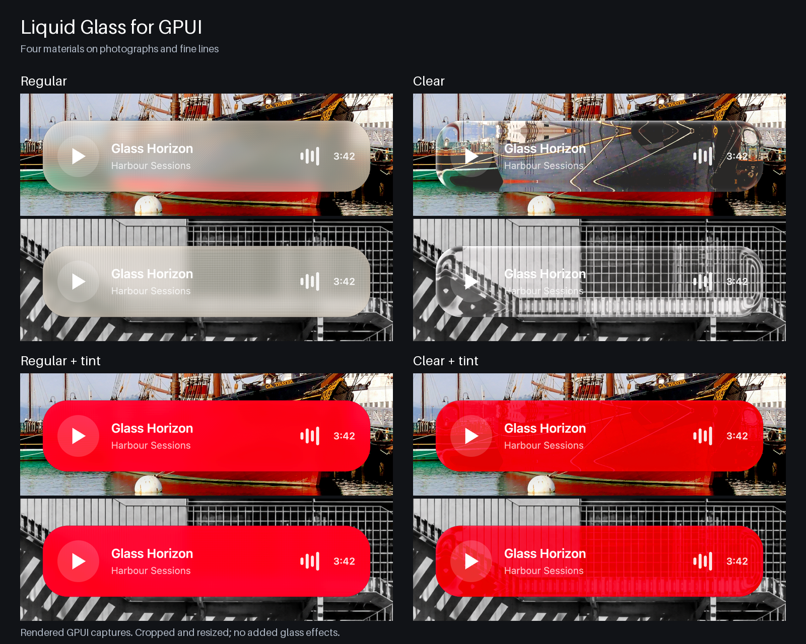

# Liquid Glass for GPUI

Glass materials for GPUI apps on macOS. Draw glass over your app's content, or use native macOS glass for the whole window.



[Image credits and licenses](IMAGE-LICENSES.md): Bernard Spragg (CC0) and project-generated backgrounds (MIT).

The image shows eight crops from the GPUI renderer. Each material appears on two backgrounds.

## Run

Requires Rust and the Xcode command-line tools on macOS.

```sh
git clone https://github.com/1234igor/gpui-liquid-glass
cd gpui-liquid-glass/gpui
cargo run --release
```

Choose a material, interaction state, and background:

```sh
cargo run --release -- clear hover facade
cargo run --release -- regular rest harbour dynamic
cargo run --release --example window_glass -- clear
```

Materials: `regular`, `clear`, `regular-tinted`, `clear-tinted`, and `identity` (no glass). States: `rest`, `hover`, and `pressed`. Backgrounds: `harbour`, `city-night`, `prism`, and `facade`.

## Add it to your app

Use the included GPUI fork. The [integration guide](docs/INTEGRATION.md) covers dependencies and complete examples.

For glass inside a window, call `gpui::enable_liquid_glass()` before creating the application. Paint the background first, glass second, and text or controls last:

```rust
window.paint_liquid_glass(PaintLiquidGlass {
    bounds,
    corner_radius: px(34.0),
    variant: GlassVariant::Clear.shader_variant(),
    interaction: InteractionState::Rest.energy(),
});
```

For a native glass window, set this field in `WindowOptions`:

```rust
window_background: WindowBackgroundAppearance::LiquidGlass(
    WindowGlassAppearance::clear().corner_radius(px(0.0)),
),
```

Native window glass requires macOS 26 or later. Earlier versions use system blur. The window owns its outer corners, so the inner glass radius is zero.

The painted material samples the current frame on the GPU. The native window path uses `NSGlassEffectView`. A separate CPU renderer is available for static images.

## Results and limits

The painted material approximates Apple's glass. The stored macOS 27 comparisons still fail two checks: Regular on the dark city, and Clear on the harbour. [Validation](validation/README.md) explains the measurements and how to repeat them. Its pixel-error scores do not mean that the same percentage of pixels match.

See [performance results](PERFORMANCE.md) for benchmarks and [showcase generation](validation/README.md#readme-image) for the image script.

[MIT license](LICENSE). The vendored GPUI fork is Apache-2.0; see [third-party notices](THIRD-PARTY.md). This project is independent of Apple.
